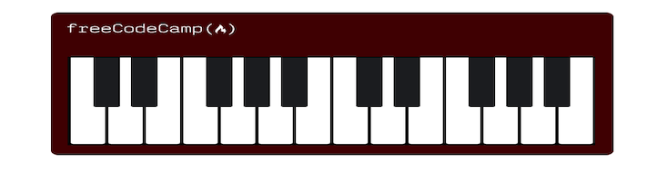

# Responsive Piano

## Description

This was a freeCodeCamp Challenge I have completed in order to learn Responsive Web Design.

Responsive Design tells your webpage how it should look on different-sized screens.

## Key Learnings

- media queries
- pseudo selectors

## Screenshot

The following image shows Piano appearance:

# Get Started

Click on this link to open the application on live server:

Hit the logo on my piano creation and let the challenge begin!

[Helena's Portfolio Page]()
